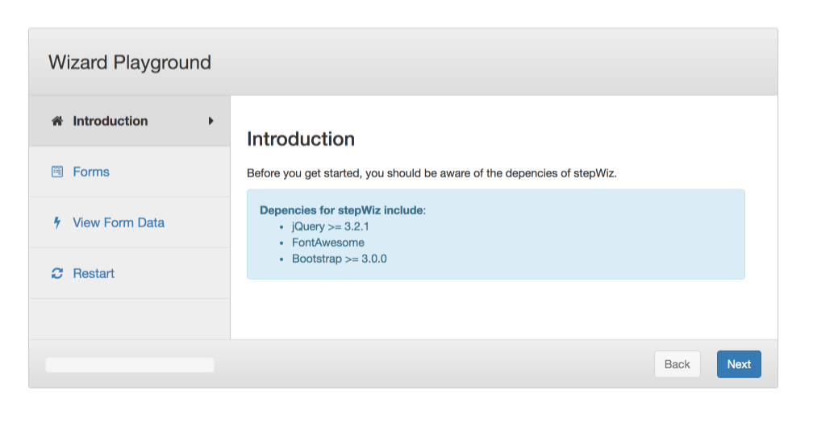

# stepWiz
Walk users through the appropriate steps easily using this Javascript library.

Preview stepWiz in action here: <a href="https://edward-of-clt.github.io/stepWiz/">https://edward-of-clt.github.io/stepWiz/</a>

Feel free to star, fork, and share this repo. 

  

## Dependencies

Depencies for stepWiz include:
* jQuery >= 3.2.1
* FontAwesome
* Bootstrap >= 3.0.0

## Examples

#### 1. Developers can easily create step-by-step user interfaces.

In order to create a fluid user interface for users easily, the developer simply needs to define three parts.

1. DOM Element
2. Step Object
3. Wizard Settings (Optional)

##### 1. Simple walk through

	let wizard = new wiz('#example1',[
		{
			title:	'Step 1',
			text:	'<h4>This is a simple step.</h4>',
			icon: 	'home'
		},
		{
			title:	'Step 2',
			text:	'<h4>This is another simple step.</h4>',
			icon: 	'home'
		}
	],{
		title: 'A simple walk-through'
	});
	
##### 2. Go to step if user completes action

	let wizard = new wiz('#example1',[
		{
			title:	'Step 1',
			text:	'<h4>This is a simple step.</h4>',
			action:	function(wiz,pass,status) {
				// do logic here
				if(true) {
					return pass(true);
				}
				return pass(false);
			},
			success: 'You can now go to the next step.',
			icon: 	'home'
		},
		{
			title:	'Step 2',
			text:	'That\'s all we got.'
		}
	],{
		title: 'A simple walk-through'
	});

## Options

| Property        | Accepted Values  | Description  						|
| --------------- | ---------------- | -------------------------------------------------------- |
| progress        | true, false      | Enables or disables the progress bar on the bottom left  |
| title      	  | string           | Defines a title for the wizard 				|
| back 		  | true, false      | Enables or disables the back button in the wizard.	|

## To Do List

1. Add ability to define a function when the wizard is complete. It would change the next button to "Finish" or whatever the user defines.
2. Finish button text as mentioned in #1.
